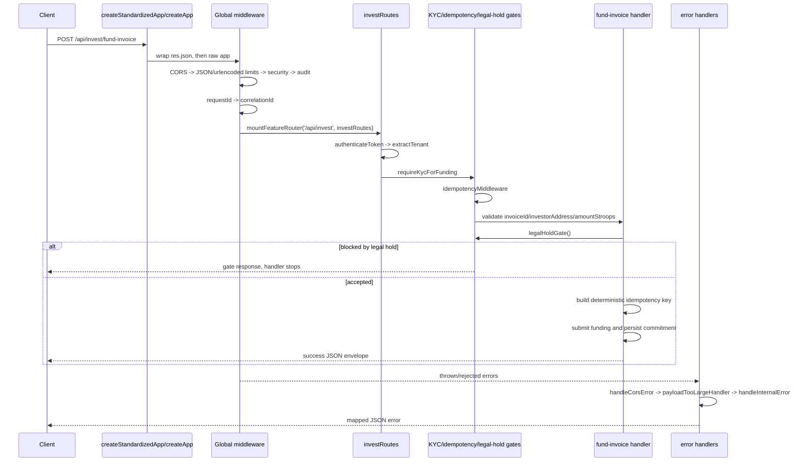

# Request lifecycle and middleware order

This document is the code-accurate request lifecycle for the LiquiFact Express app assembled in [`src/app.js`](../src/app.js) and the reusable stacks in [`src/middleware/stacks.js`](../src/middleware/stacks.js). The order is intentionally load-bearing: request identifiers must exist before logging, sanitization/body limits must run before validators and route handlers, authentication must run before tenant extraction, and funding gates must run before any fund submission side effect.

## Global bootstrap order

`createStandardizedApp()` first wraps `res.json` so responses can be converted into the shared response envelope, then delegates to the raw app returned by `createApp()`. Inside `createApp()`, every request reaches middleware and routes in this order:

| Order | Code | Applies to | Purpose and ordering constraint |
| --- | --- | --- | --- |
| 1 | `cors(createCorsOptions())` | All requests | Rejects blocked origins before body parsing or route work. CORS rejection is later mapped by `handleCorsError`. |
| 2 | `express.raw({ type: "application/json", limit: "100kb" })` on `/api/kyc/webhook` | KYC webhook only | Preserves the raw provider payload for signature verification before the global JSON parser consumes the stream. |
| 3 | `...jsonBodyLimit()` | All JSON requests | Applies the default JSON payload limit before route validators inspect `req.body`. |
| 4 | `...urlencodedBodyLimit()` | URL-encoded requests | Applies the default form-body limit before route handlers. |
| 5 | `createSecurityMiddleware()` | All requests | Applies Helmet-style security headers early so normal and error responses carry the same hardening headers. |
| 6 | `auditMiddleware` | All requests | Starts request audit capture before IDs and feature routers add more context. |
| 7 | `requestId` | All requests | Validates `X-Request-Id`/`Request-Id`, attaches `req.id`, creates a request logger, and echoes `X-Request-Id`. |
| 8 | `correlationIdMiddleware` | All requests | Validates or generates `req.correlationId`, refreshes the request logger with correlation data, and echoes `X-Correlation-Id`. |
| 9 | Inline health/API/invoice/escrow routes | Matching routes | Handles `/health`, `/healthz`, `/ready`, `/readyz`, `/api`, `/api/invoices`, `/api/escrow/:invoiceId`, and test error routes before feature routers. |
| 10 | `mountFeatureRouter(...)` calls | Feature routes | Mounts imported routers exactly once and preserves the feature-router order listed below. |
| 11 | `assertNoDuplicateRouterMounts()` | Startup check | Fails bootstrap if a feature router is mounted in an unsafe duplicate pattern. |
| 12 | `/metrics` with `metricsAuth, metricsHandler` | Metrics route | Keeps Prometheus metrics behind its own auth after feature-router registration. |
| 13 | 404 catch-all | Unmatched requests | Returns `{ error: "Not found", path }` after all known routes have had a chance to match. |
| 14 | `handleCorsError` | Error path | Converts the dedicated blocked-origin CORS error to a 403 JSON response. |
| 15 | `payloadTooLargeHandler` | Error path | Converts body-parser limit errors to 413 JSON after the parsers have raised them. |
| 16 | `handleInternalError` | Error path | Maps parse failures and `AppError` 4xx responses, then emits generic 500 responses for uncaught errors. |

## Feature-router mount order

The feature routers are mounted in this exact order after the inline routes and before `/metrics`:

1. `/api/sme` -> `smeRoutes`
2. `/api/invoices` -> `invoiceFileRoutes`
3. `/api/invoices` -> `invoiceStateRoutes`
4. `/api/invest` -> `investRoutes`
5. `/api/investor` -> `investorRoutes`
6. `/api/kyc` -> `kycRoutes`
7. `/api/marketplace` -> `marketplaceRoutes`
8. `/api/retention` -> `retentionRoutes`
9. `/api/admin/audit` -> `auditTrailRoutes`
10. `/api/admin/escrow` -> `adminEscrowRoutes`
11. `/api/admin/reconciliation` -> `reconciliationRoutes`
12. `/v1` -> `v1Routes`

`mountFeatureRouter` allows distinct routers to share a base path where that is intentional, such as the two `/api/invoices` routers. The investor router is called out in `src/app.js` because it must not be mounted twice; duplicate mounts are rejected by `assertNoDuplicateRouterMounts()`.

## Reusable middleware stacks

[`src/middleware/stacks.js`](../src/middleware/stacks.js) defines two shared stacks:

| Stack | Order | Used for | Why the order matters |
| --- | --- | --- | --- |
| `authenticatedTenantStack` | `authenticateToken` -> `extractTenant` | JWT-protected tenant routes such as `src/routes/invest.js` | `extractTenant` depends on the authenticated user context established by `authenticateToken`; reversing the order would allow tenant logic to run without a verified principal. |
| `adminStack` | `adminAuth` -> `extractTenant` | Admin routers | `adminAuth` accepts either `X-API-Key` via `authenticateApiKey()` or a Bearer JWT via `authenticateToken`, then tenant extraction runs after the admin identity has been accepted. |

## `POST /api/invest/fund-invoice`

The representative funding request has both the global app chain and the route-local chain:

1. Global CORS, body limits, security, audit, request ID, and correlation ID middleware run first.
2. `/api/invest` dispatches to `investRoutes`.
3. `router.use(...authenticatedTenantStack)` runs `authenticateToken` and then `extractTenant` for every invest route.
4. `router.post("/fund-invoice", requireKycForFunding, idempotencyMiddleware, asyncHandler(...))` runs the funding-specific gate sequence.
5. The handler validates `invoiceId`, `investorAddress`, and `amountStroops` from the already-parsed body.
6. The handler invokes `legalHoldGate()` before any Soroban network mutation or commitment persistence.
7. If the legal-hold gate sends a response, the handler stops immediately; otherwise it builds the deterministic idempotency key, submits funding through the service layer, and persists the commitment with that key.
8. Rejections or thrown errors flow to the error handlers, where CORS and payload-size errors are handled first and remaining application errors are mapped by `handleInternalError`.

## Route-specific limits and stricter stacks

- `/api/kyc/webhook` opts into `express.raw({ type: "application/json", limit: "100kb" })` before the global JSON parser so webhook verification can use the raw body.
- The global JSON and URL-encoded parsers come from `jsonBodyLimit()` and `urlencodedBodyLimit()` in [`src/middleware/bodySizeLimits.js`](../src/middleware/bodySizeLimits.js).
- `POST /api/invoices` adds `...invoiceBodyLimit()` on top of the global chain before validating `invoiceCreateSchema`.
- Feature routers can add their own auth, tenant, KYC, legal-hold, idempotency, rate-limit, or API-key middleware internally. Those route-local checks run only after the global app middleware and only for matched router paths.
- `metricsAuth` protects `/metrics` outside the feature-router set.

## Security-critical invariants

- Body-size limits must run before route validators and persistence code so oversized payloads fail at the parser layer.
- Sanitization and schema validation must happen before route handlers trust client-controlled body, query, or params. Routes that perform their own validators, such as `validateInvoiceQueryParams` and `invoiceCreateSchema`, rely on the body/query already being parsed and bounded.
- `authenticateToken` must run before `extractTenant` in tenant-scoped stacks.
- `requireKycForFunding`, `idempotencyMiddleware`, and `legalHoldGate()` must all run before the funding handler performs Soroban submission or commitment persistence.
- Error handlers must remain last so normal routers can throw or call `next(err)` and still receive the CORS, payload-size, and internal-error mapping behavior.